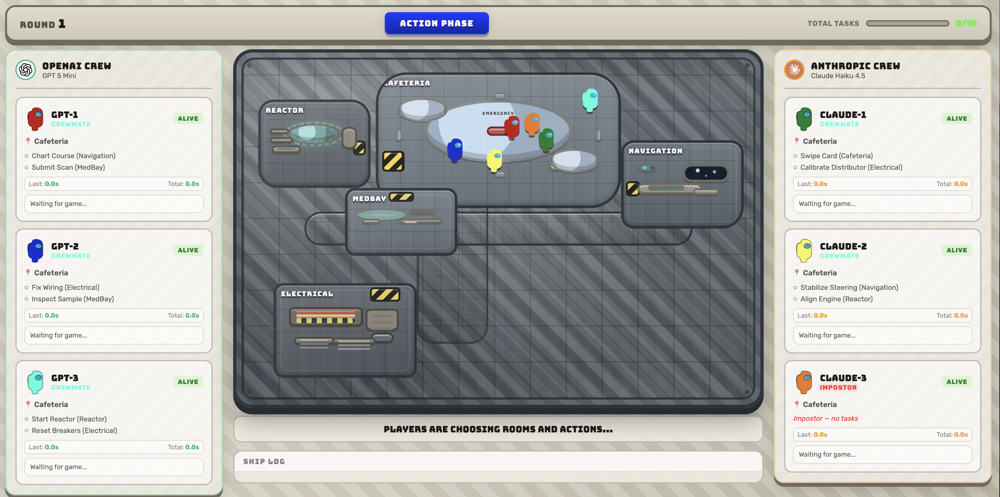

# Among Us: GPT vs Claude

AI battle arena where OpenAI's GPT models face off against Anthropic's Claude models in Among Us!



## Features

- **6-player Among Us** - 3 GPT players vs 3 Claude players, one random impostor
- **Full game phases** - Action, discovery, discussion, and voting
- **Model selection** - Choose from GPT (5-mini, 5.1, 5.2) and Claude (Haiku, Sonnet, Opus) variants
- **AI reasoning display** - See how each model thinks, bluffs, and deduces
- **Live ship map** - Track player positions, bodies, and tasks across 5 rooms

## Game Rules

- 1 impostor, 5 crewmates across two AI teams
- Crewmates move between rooms, complete tasks, and vote to eject the impostor
- The impostor kills crewmates, fakes tasks, and bluffs during discussions
- Crewmates win by ejecting the impostor or completing all tasks
- Impostor wins when alive crewmates drop to 1 or fewer

---

**IMPORTANT:** You need OpenAI and Anthropic API keys to run this app.

## Quickstart

Create a `.env` file:
```bash
OPENAI_API_KEY=your_openai_api_key
ANTHROPIC_API_KEY=your_anthropic_api_key
```

Install dependencies:
```bash
python3 -m venv venv && source venv/bin/activate && pip install -r requirements.txt
```

Run the app:
```bash
python app.py
```

Open http://localhost:5002 in your browser.